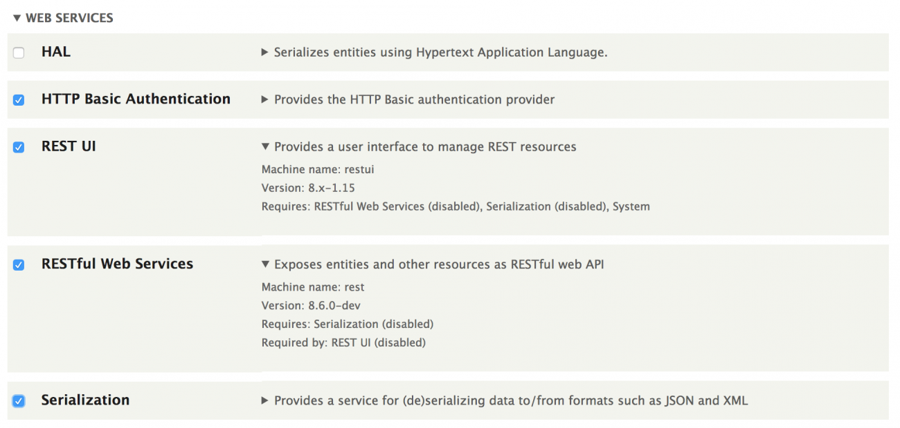
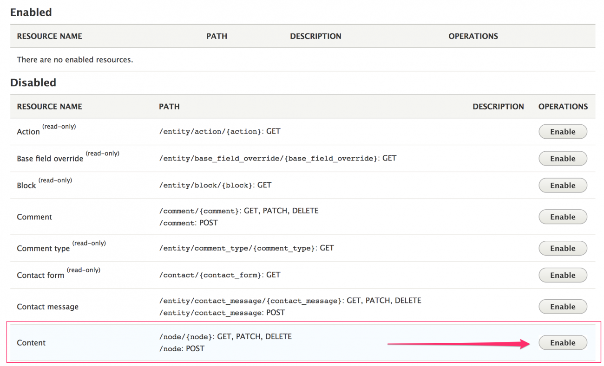
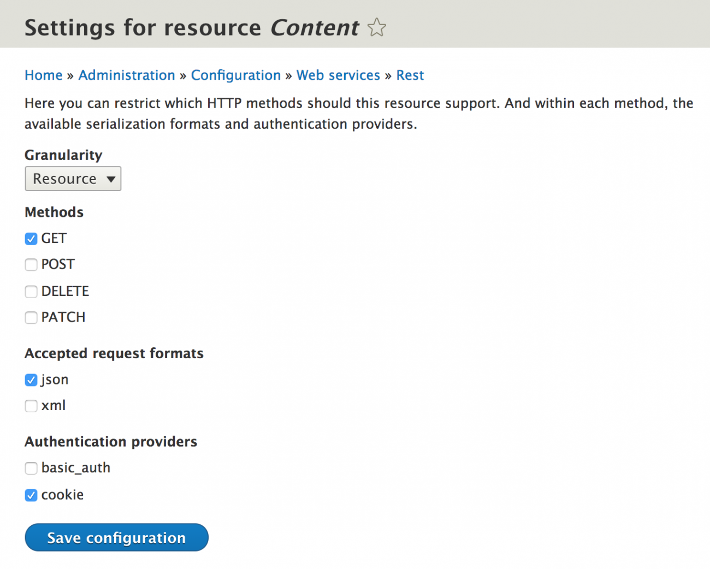
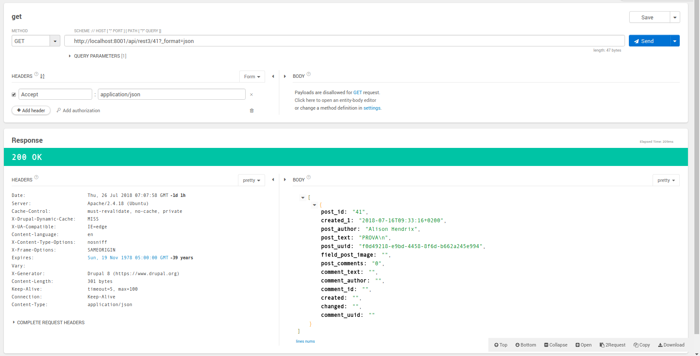
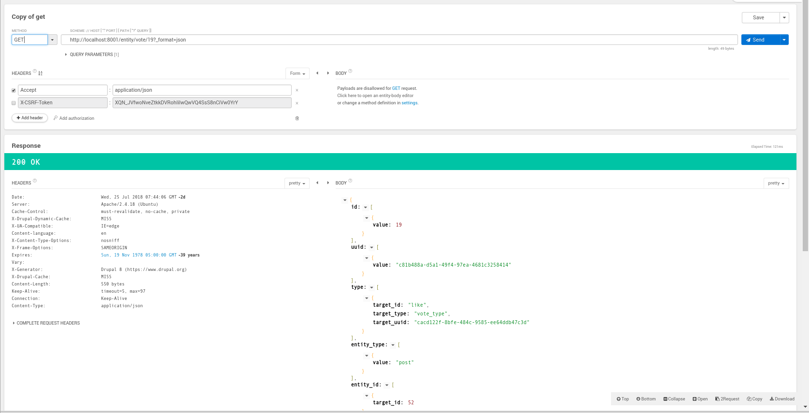

<center> </center>
<br/>
<center><font size="4"><b>ASSEGNAMENTO DI SISTEMI DISTRIBUITI</b></font>	</center>

<br/>
<center><font size="6"><b>IMPLEMENTAZIONE DELL'ESPORTAZIONE ED IMPORTAZIONE DELLO STREAM SOCIALE DI OPENSOCIAL MEDIANTE CHIAMATE REST </b></font></center>


<br/>

# Indice
1. [Configurazione di OPENSOCIAL per le chiamate REST](#configurazione-di-opensocial-per-le-chiamate-rest)
2. [Gestione delle view](#gestione-delle-view)
   1. [Importazione delle view custom](#importazione-delle-view-custom)
3. [Definizione di una API custom](#definizione-di-una-api-custom)
   1. [Test API custom](#test-api-custom)
4. [Script PHP](#script-php)
 1. [FeedDownloader](#feeddownloader)
 2. [FeedUploader](#feeduploader)
	 1. [Formulazione di una richiesta POST](#formulazione-di-una-richiesta-post)
5. [Creazione delle strutture json](#creazione-delle-strutture-json)
  1. [createPost](#createpost)
 2. [createPostComment](#createpostcomment)
 3. [uploadImage](#uploadimage)
 4. [updateLikes](#updatelikes)
6. [Definizione di nuove strutture](#definizione-di-nuove-strutture)


## Configurazione di OPENSOCIAL per le chiamate REST
Al fine di poter utilizzare comodamente le chiamate REST è necessario abilitare alcuni moduli che permettano di gestire i permessi degli utenti, così come l'accesso ai contenuti.

Viene qui data per scontata la configurazione iniziale di Opensocial (si consiglia la lingua inglese) così come [l'installazione di Drupal8](https://www.youtube.com/watch?v=7Ro3Ci3n00c&t=10s).

Per la gestione dei moduli è altamente consigliato l'utilizzo di
[composer](https://getcomposer.org/download/). Una volta installato e correttamente configurato, è possibile aggiungere qualsiasi modulo a Drupal8 con il seguente comando ([maggiori dettagli nella documentazione](https://www.drupal.org/docs/develop/using-composer/using-composer-to-manage-drupal-site-dependencies#adding-modules)):

`composer require drupal/<modulename>`


I moduli da installare sono:
* [REST UI](https://www.drupal.org/project/restui)
* [File Entity](https://www.drupal.org/project/file_entity)
* [Drupal Console](https://hechoendrupal.gitbooks.io/drupal-console/content/en/getting/composer.html)

File Entity presenta un bug che non permette ai file caricati con chiamata REST di essere referenziabili e soprattutto definitivi. A tale scopo è possibile indicare all'interno del file *composer.json* , nella categoria *extra* il link alla patch nel seguente formato:

``` json
"patches":{
        "drupal/file_entity":{
        	"file entity fix temporary images" : "https://www.drupal.org/files/issues/file_entity_save_permanent-2756127-19.patch"
        	}
        }
```


Una volta installati potrete andarli ad abilitare direttamente dal pannello moduli su drupal ("gestisci -> estendi") assieme ai seguenti moduli:

* HAL
* HTTP Basic Authentication
* RESTful Web Services
* Serialization



Una volta installati tutti i moduli, sarà possibile accedere al pannello della configurazione REST ("configurazione -> webServices -> REST")
<a name="enable-resources"></a>

Qui bisognerà abilitare le risorse che si intende rendere accessibili tramite chiamata REST.





In particolare per il progetto sono stati abilitate le seguenti risorse con metodi GET e POST, formati hal_json e json, ed autenticazione mediante cookie:

* Commento
* Contenuto (post)
* File
* Utente
* Vota

Una volta abilitate, si potrà accedere alle informazioni mediante chiamate agli url forniti nella colonna **PATH**.

Per ogni risorsa che viene abilitata, nel menù permessi ("persone -> permessi" o "persone -> ruoli -> permessi" per una gestione separata) verranno create delle voci: è necessario aggiungere tutti i permessi necessari per l'**utente anonimo**.

## Gestione delle view

Druapl possiede uno strumento molto potente, in grado di mostrare i contenuti del sito in modi differenti, senza dover ricorrere alla definizione di query. Le view, infatti, mascherano la complessità sottostante, permettendoci di definire in maniera agile dei raggruppamenti per le informazioni di interesse.

Per definire una nuova view basta entrare nel menù admin di Drupal8 e selezionare "Gestione->Struttura->Views".

Attraverso le impostazioni della view potremo andare a definire che cosa vogliamo rappresentare (contenuto, tipo di contenuto ed ordine in cui vogliamo mostrarlo). Nel nostro caso non sarà necessario creare una pagina associata poiché ci interesserà generare solamente una vista da associare ad un url a cui fornire i dati.

A tal proposito bisogna spuntare la funzionalità "**provide Rest Export**" e fornire l'url a cui vorremo esporre le informazioni (anche detto endpoint): vedremo come creare tale url nella prossima sezione.

Procedendo nella schermata successiva, sarà possibile selezionare il formato in cui esportare i dati (json nel nostro caso) e scegliere se mostrare l'intera entity o solamente alcuni campi di interesse, andando anche a specificare un alias per le etichette associate.

E' possibile visualizzare una preview delle informazioni che verranno esposte, direttamente sotto il box delle impostazioni.

Una volta completata la configurazione potremo procedere a salvare la view.

### Importazione delle view custom

Nella cartella chiamata *yaml di configurazione* sono forniti alcuni file contenenti le configurazioni utilizzate per le custom view generate al fine di esportare tutti i dati utilizzati nel progetto.

Queste possono essere importate direttamente dalla UI di Drupal8 mediante il menù *configurazione di sincronizzazione* sotto "configurazione -> sviluppo".

E' importante notare che tali view presentano già degli endpoint associati che vanno abilitati seguendo le istruzioni del prossimo paragrafo.

 ## Definizione di una API custom

 Per poter accedere alle view appena create mediante chiamate REST, è necessario definire degli endpoint per l'accesso (l'equivalente dei PATHS visti prima). Questi sono configurabili dal menù delle view ("struttura -> views") e sono visibili nella colonna **display**.
 In particolare sono importanti quelli che compaio fra parentesi dopo la dicitura *REST export* poiché rappresentano gli endpoint che dobbiamo aggiungere .

 Prima di procedere, è bene configurare un modulo custom in cui andremo ad inserire tutti gli endpoint così da poterlo rimuovere in caso di problemi.

 Tale modulo può essere creato all'interno del percorso

`html/profiles/contrib/social/modules/custom`

Supponiamo di voler chiamare il modulo **demo_rest_api** :  basterà creare una cartella così definita e inserirvi all'interno un file *yaml* contenente i seguenti dati (possono essere personalizzati):

```yaml
name: Demo REST API
description: Define's a custom REST Resource
package: Custom
type: module
core: 8.x
```

una volta creata la cartella, questa apparirà come modulo nel pannello dei moduli.

A questo punto, basta utilizzare il comando dalla druapl console:

` drupal generate:plugin:rest:resource`

Il comando va eseguito dalla root del progetto: seguire le indicazioni a schermo, avendo cura di indicare come modulo quello appena creato e inserire come url quelli forniti nella view (in alternativa bisognerà modificare quest'ultimi nel menù delle view).

#### Test API custom

Per verificare il corretto funzionamento del sistema vi basterà fare una chiamata GET mediante un qualsiasi [client REST](https://chrome.google.com/webstore/detail/restlet-client-rest-api-t/aejoelaoggembcahagimdiliamlcdmfm) ad esempio all'url `http://localhost:PORT/api/rest3?_format=json `
, indicando nell'header della chiamata una *Accept* di tipo *application/json*, per ottenere la lista di tutti i post.

In alternativa è possibile ottenere un singolo post andando a specificarne l'ID direttamente nell'url:

`http://localhost:PORT/api/rest3/41?_format=json `

```json
[
	{
		"post_id": "41",
		"created_1": "2018-07-16T09:33:16+0200",
		"post_author": "Alison Hendrix",
		"post_text": "PROVA\n",
		"post_uuid": "f0d49218-e9bd-4458-8f6d-b662a245e994",
		"field_post_image": "",
		"post_comments": "0",
		"comment_text": "",
		"comment_author": "",
		"comment_id": "",
		"created": "",
		"changed": "",
		"comment_uuid": ""
	}
]
```



Nel caso si sia scelto un diverso nome per l'endpoint, sarà necessario andarlo a specificare nell'url secondo la seguente struttura:

			http://website:PORT/rest_endpoint_path/%?_format=json


## Script PHP

Per il progetto sono stati realizzati due scritp chiamati rispettivamente **FeedDownloader.php** e **FeedUploader.php**.

### FeedDownloader
FeedDownloader, come è possibile evincere dal nome, si preoccupa di scaricare i dati dal sito web *remoto* (d'ora in avanti ci riferiremo sempre in questo modo al sito da cui vogliamo attingere i feed) e salvarli in una serie di file json chiamati con il medesimo nome dell'endpoint (è possibile personalizzare il nome con cui i dati vengono salvati).


```php

<?php
	/**
	* @param string $apiAccessPoint l'url dell'access point
	* @param string $saveFileName   nome file per il salvataggio
	* @param string $format tipo di dato che si vuole scaricare
	* @param string $remoteServer  url server remoto
	* @throws Exception Se la richiesta fallisce
	*/

	function downloadFeeds($apiAccessPoint,$saveFileName,$format='json', $remoteServer='http://localhost:8001/')
?>
```

Le view presenti nei file yaml permettono già di accedere alla lista dei post e dei relativi commenti, sia del feed di ciascun utente che delle pagine delle varie community. E' anche predisposto il download dei messaggi così come dei voti ai post ed ai commenti.

### FeedUploader

FeedUploader contiene tutte le funzioni necessarie a caricare i dati su una nuova sessione di Opensocial.
Nella versione corrente viene illustrato come gestire i post degli utenti e i commenti ai relativi post. si procederà quindi [a mostrare come agire per implementare nuove funzionalità](#definizione-di-nuove-strutture).

L'attuale implementazione prevede di utilizzare il nome utente di ogni user e la data del post per identificare ed indicizzare correttamente i post ed i commenti. Tale nome utente è univoco e definito come stringa priva di spazi, minuscola e generata dal nome del proprietario (*ex*: "Jason Ramsey" -> usr: jasonramsey).

il ciclo principale del programma è contenuto interamente nella funzione `updatePostAndComments()`.

Lo script si preoccupa di ottenere l'ultimo post presente nel feed dell'utente locale e ne recupera la data.
In un secondo momento si procede a caricare il file json (*results3.json*) contenente i dati dell'utente remoto (post e commenti) e si scorrono tutti.

L'accesso ai dati caricati dal file json è strettamente condizionato al modo in cui sono stati esportati dalle view definite su Drupal8. A tal fine è necessario specificare i parametri di accesso ai campi della struttura, dopo averla convertita in un oggetto sfruttabile da PHP.

I parametri riportati nello snippet della funzione `updatePostAndComments()` fanno riferimento alla struttura json riportata nella sezione [Test API custom](#test-api-custom)

Vengono solamente trattati i post appartenenti alla cerchia di amici dell'utente locale che sono stati pubblicati dopo il post più recente attualmente presente nella home dell'utente locale.

Se esiste un post che rispetta tali condizioni, ne vengono recuperate tutte le informazioni e [viene creata la struttura json](#creazione-delle-strutture-json) da passare alla chiamata POST `postRequest()`. Per ogni nuovo post che viene aggiunto, si controlla l'eventuale presenza di commenti e, se presenti, si aggiungono al post ordinandoli per data.

All'interno dell' *else* viene, invece, gestita la condizione in cui non vi siano nuovi post da aggiungere, ma possano esserci nuovi commenti.
Per ogni post presente nella lista dei post remoti, viene cercato il corrispettivo nella lista dell'utente locale e si calcola il numero di nuovi commenti. In caso ci siano nuovi commenti, viene generata la struttura json da passare alla chiamata POST fatta sempre tramite il metodo `postRequest()`.

```php
<?php
	/**
     * DEMO
     * ciclo di aggiornamento dei posts
     * @throws Exception
     */
    function updatePostAndComments(){
        $latest_post = getCurrentUserPosts(true);
        $latest_post_date= new DateTime( $latest_post["created_1"]);


        // feed utente remoto
        $string = file_get_contents("results3.json");
        $json_a = json_decode($string, true);

        $i=0;
        while  ($i < count($json_a)){
            //se trovo un post pubblicato dopo l'ultimo mio post e l'autore è conosciuto dall'utente
            $post=$json_a[$i];
            if(new DateTime($post["created_1"])>$latest_post_date && findID($post["post_author"])[0] >-1){
                echo $post["created_1"],PHP_EOL;
                $post_author= findID($post["post_author"]);
                $post_date = $post["created_1"];
                $post_message= $post["post_text"];
                $post_photo= $post["field_post_image"];
                $post_data=createPost($post_author,$post_message,$post_date, $post_photo,"http://localhost:8001"); //genero la struttura per la post REST
                $jsonData = json_encode($post_data, JSON_PRETTY_PRINT);
                echo postRequest($jsonData,getToken('http://localhost:8002'),'http://localhost:8002'),PHP_EOL; // post
                $post_comments=$post["post_comments"];
                for ($j=$i; $j<$i+$post_comments; $j+=1){ //ciclo sui commenti del post
                    $npost=$json_a[$j];
                    $comment_text=$npost["comment_text"];
                    $comment_author=findID($npost["comment_author"]);
                    $comment_date = $npost["created"];
                    if($comment_author[0]>-1){
                        $usersPost=getCurrentUserPosts(false);
                        $post_comment_data=createPostComment(findPostID($usersPost,$post_author,$post_date),$comment_author,$comment_text,$comment_date);
                        $jsonData = json_encode($post_comment_data, JSON_PRETTY_PRINT);
                        echo postRequest($jsonData,getToken('http://localhost:8002'),'http://localhost:8002',"/comment"),PHP_EOL;
                    }
                }
                if ($post_comments!=0){
                    $i+=($post_comments-1);
                }
            }
            else{
                $post_author= findID($post["post_author"]);
                $post_date = $post["created_1"];
                $usersPost=getCurrentUserPosts(false); //refresh
                $post_info=findPostID($usersPost,$post_author,$post_date); //recupero l'ID del post (dell'utente corrente) basandomi sulle info fornite da remoto
                $post_comments=$post["post_comments"]; //recupero il numero dei commenti
                if ($post_info!=null && $post_author[0]>-1){ //se c'è un post effettivamente creato che va aggiornato
                    $upost=getUserPost($usersPost,$post_info); //recupero le informazioni del post
                    $new_comments=$post_comments-$upost["post_comments"]; //guardo quanti commenti vanno aggiornati
                    if ($new_comments>0){
                        for ($j=$i; $j<$i+$post_comments; $j+=1){ //ciclo sui commenti del post
                            $npost=$json_a[$j];
                            $comment_text=$npost["comment_text"];
                            $comment_author=findID($npost["comment_author"]);
                            $comment_date = $npost["created"];
                            if(findCommentID($usersPost,$comment_author,$npost["created"])==null){
                                $usersPost=getCurrentUserPosts(false);
                                $post_comment_data=createPostComment(findPostID($usersPost,$post_author,$post_date),$comment_author,$comment_text,$comment_date);
                                $jsonData = json_encode($post_comment_data, JSON_PRETTY_PRINT);
                                echo postRequest($jsonData,getToken('http://localhost:8002'),'http://localhost:8002',"/comment"),PHP_EOL;
                            }
                        }

                    }
                }
                if ($post_comments!=0){
                    $i+=($post_comments-1);
                }
            }
            $i+=1;
        }
    }
?>
```

#### Formulazione di una richiesta POST

Di seguito è riportato un esempio di codice utilizzato per formulare una richiesta POST per
la pubblicazione di un contenuto di tipo *post* o *commento*.

E' bene notare che per l'autenticazione delle operazioni dannose, è richiesto di fornire un X-CSRF-Token ottenibile mediante un'apposita funzione chiamata `getToken($website)`.

La funzione può essere sfruttata per altre operazioni di POST, andando a specificare differenti url e access point.

Se l'operazione termina correttamente, la funzine presenterà nel parametro di ritorno `$response` il json contenente le informazioni dell'entity appena creata. Questo non vale per la richiesta di pubblicazione di un post che, nonostante vada a buon fine, ritorna sempre un errore di connessione al server (500). 

```php

<?php

	/**
	 * @param string $data
	 * @param string $token
	 * @param string $website sito a cui fare la richiesta
	 * @param string $format formato di $data
	 * @param string $apiAccessPoint access point risorsa REST
	 * @param string $applicationFormat formato del file di risposta (json/hal+json...)
	 * @return mixed errors or json output
	 * @throws Exception
	 */
	function postRequest($data, $token,$website='http://localhost:8002',$apiAccessPoint='/entity/post', $format='json', $applicationFormat='json'){


			$url=$website.$apiAccessPoint.'?_format='.$format;

			$ch = curl_init($url);
			curl_setopt_array($ch, array(
					CURLOPT_POST => TRUE,
					CURLOPT_RETURNTRANSFER => TRUE,
					CURLOPT_HTTPHEADER => array(
							'X-CSRF-Token: '.$token,
							'Content-Type: application/'.$applicationFormat
					),
					CURLOPT_POSTFIELDS => $data
			));

			// Send the request
			$response = curl_exec($ch);
			if(curl_errno($ch)){
					throw new Exception(curl_error($ch));
			}
			curl_close($ch);

			// Check for errors
			if($response === FALSE){
					die(curl_error($ch));
			}
			return  $response;
	}


?>


```

## Creazione delle strutture json

Per poter effettuare le chiamate REST di tipo POST è necessario passare i dati nel formato (json o hal_json) corretto.
Di seguito vengono illustrati i template che sono stati utilizzati nei metodi
`createPost()` e `createPostComment()` così come all'interno del metodo `uploadImage()`.

Le funzioni sono state definite in modo da essere le più generiche possibili. In questo modo è possibile sfruttarle per generare contenuti diversificati. Maggiori informazioni in merito alle funzioni sono definite nelle descrizioni all'interno dello script.

Le strutture qui riportate sono state ottenute andando ad analizzare le risposte fornite dal server ad una chiamata GET sulla risorsa esposta dall'access point. Maggiori informazioni sul procedimento per la definizione di nuove strutture viene fornito al [capitolo successivo](#definizione-di-nuove-strutture).

### createPost

Il file json che deve essere popolato richiede di specificare un ID per l'utente ed eventualmente anche un UUID. Tali informazioni sono necessarie per poter collegare l'utente al post. E' anche possibile specificare un utente anonimo (indicato con l'ID "0" ).

Se non viene fornita una data di creazione, il post verrà pubblicato con la data registrata al momento della chiamata REST.
Il contenuto del post dovrà essere specificato in *field_post* all'interno del campo *value*.

```json
{
	"type":[
		{
			"target_id": "post"
		}
	],
	"user_id": [
	   {
	    "target_id": 0,
	    "target_type": "user",
	    "target_uuid": "2f8d737e-0050-4e76-8d3c-eac85966f1f2",
	    "url": "\/en\/user\/0\/stream"
		}
	],
	"field_post":[
		{
			"value": "Post Body\n",
			"format": "basic_html",
			"processed": "<p>Post Body\n"
		}
	],
	"created":[
		{
			"value": "2018-07-10T07:33:16+00:00",
			"format": "Y-m-d\\TH:i:sP"
		}
	],
	"field_visibility":[
		{
			"value": "0"
		}
	]
}
```
Nel caso in cui il post contenga un'immagine in allegato, presupponendo che questa sia già presente sul sito (in caso contrario è necessario caricarla con l'apposito metodo), il campo *type* andrà modificato da *post* a **photo** e sarà necessario aggiungere il seguente valore al file:

```json
"field_post_image":[
	{
		"target_id":"54"
	}
]
```
dove *target_id* fa riferimento all'ID dell'immahine presente nel DB.


### createPostComment

Anche in questo caso sono richieste le informazioni riguardo all'utente a cui associare il commento ed al testo del commento stesso. Non solo, è necessario specificare tutte le informazioni necessarie a collegare il commento al relativo post.
Il resto della struttura rimane fisso.

```json
{
	"comment_type":[
		{
			"target_id": "post_comment",
			"target_type": "comment_type"
		}
	],
	"status":[
		{
			"value": true
		}
	],
	"pid":[],
	"entity_id":[
		{
			"target_id": 53,
			"target_type": "post",
			"target_uuid": "78a011aa-3939-463c-aab7-77c6eeef7bff",
			"url": "/post/53"
		}
	],
	"subject":[],
	"uid":[
		{
			"target_id": 13,
			"target_type": "user",
			"target_uuid": "44fc40ec-da2f-11e5-b5d2-0a1d41d68578",
			"url": "/it/user/13/stream"
		}
	],
	"name":[],
	"mail":[],
	"homepage":[],
	"entity_type":[
		{
			"value": "post"
		}
	],
	"field_name":[
		{
			"value": "field_post_comments"
		}
	],
	"default_langcode":[
		{
			"value": true
		}
	],
	"field_comment_body":[
		{
			"value": "Comment Body\n",
			"format": "basic_html",
			"processed": "<p>Comment Body</p>\n"
		}
	]
}

```
### uploadImage

Le api REST per effetturare una POST non permettono di utilizzare il formato json, bensì quello *hal_json* che richiede un parametro addizionale *_links* che referenzi il tipo di file che si sta caricando.
E' anche necessario specificare il tipo di immagine con il campo *filemime* ed un uri pubblico a cui associarlo.

E' **necessario** specificare un uri poiché altrimenti, a causa di un bug di Drupal8, le immagini vengono caricate in formato *octet-stream*, che non può essere referenziato nei post.

L'immagine deve essere fornita in formato base64 come campo *data* all'interno del file json.

```json

{
	"_links": {
		"type": {
		  "href": "http://localhost:8001/rest/type/file/image"
		}
	},
	"filename": [
		{
		  "value": "favicon-32x32.png"
		}
	],
	"filemime": [
		{
		  "value": "image/png"
		}
	],
	"type": [
		{
		  "target_id": "image"
		}
	],
	"data": [
		{
		  "value": "your_base64_value"
		}
	],
	"uri": [
		{
		  "value": "public://favicon-32x32.png"
		}
	]
}
```

### updateLikes

Questa funzione non è stata implementata nel progetto a causa di un bug nella [votingapi](https://www.drupal.org/project/votingapi) di drupal8.
In sostanza, la chiamata REST POST funziona solamente se il post (o commento) a cui stiamo cercando di mettere *like* possiede un ID che è utilizzato anche come ID di un evento (categorizzato sotto l'url */node/%* ).

Se ciò non fosse, ovvero se provassimo a mettere un like ad un post che non ha un ID presente anche fra gli eventi, viene restituito un errore di **unprocessable entity** (422).

E' comunque possibile verificare la bontà della struttura json qui riportata, andando ad utilizzare un client REST mediante metodo post, indicando come ID target, un valore che possegga un rispettivo nodo.

Anche per questa struttura json valgono le considerazioni fatte in precedenza in merito all'ID dell'utente a cui deve essere associato il like.

```json
{
	"type":[
		{
			"target_id": "like",
			"target_type": "vote_type"
		}
	],
	"entity_type":[
		{
			"value": "post"
		}
	],
	"entity_id":[
		{
			"target_id": 70
		}
	],
	"value":[
		{
			"value": 1
		}
	],
	"value_type":[
		{
			"value": "points"
		}
	],
	"user_id":[
		{
			"target_id": 13,
			"target_type": "user",
			"url": "/en/user/13/stream"
		}
	],
	"timestamp":[
		{
			"value": "2018-07-16T08:03:28+00:00",
			"format": "Y-m-d\\TH:i:sP"
		}
	]
}
```
## Definizione di nuove strutture

E' possibile estendere le funzionalità dello script andando ad introdurre la possibilità di interagire con altre componenti di Drupal8. I passi da eseguire a tal fine sono i seguenti:

* Abilitazione delle risorse accessibili con chiamata Rest
* Definizione del formato e del metodo di autenticazione
* Aggiunta dei permessi agli utenti desiderati
* Identificazione della struttura nel formato scelto
* Eventuale creazione di view dedicate
* Definizione della chiamata Rest

Il procedimento richiesto per abilitare nuove risorse ed esporne le API REST è il medesimo descritto durante la [configurazione di OpenSocial](#enable-resources).

Una volta abilitata la risorsa e definito il metodo di autenticazione, è possibile procedere a verificare in che modo debbano essere passati i dati per un'eventuale azione POST.

Il modo migliore è quello di sfruttare un client REST e provare a fare una chiamata all'access point esposto dal metodo GET (sempre visualizzabile nella colonna *PATHS* in "configurazione -> webServices -> REST").



Una volta ottenuta una risposta positiva (**200 OK**) sarà possibile visualizzare nel body le informazioni fornite nel formato specificato dalla richiesta.

```json
{
	"id":[
		{
			"value": 19
		}
	],
	"uuid":[
		{
			"value": "c81b488a-d5a1-49f4-97ea-4681c3258414"
		}
	],
	"type":[
		{
			"target_id": "like",
			"target_type": "vote_type",
			"target_uuid": "cacd122f-8bfe-484c-9585-ee64ddb47c3d"
		}
	],
	"entity_type":[
		{
			"value": "post"
		}
	],
	"entity_id":[
		{
			"target_id": 52
		}
	],
		"value":[
		{
			"value": 1
		}
	],
	"value_type":[
		{
			"value": "points"
		}
	],
	"user_id":[
		{
			"target_id": 0,
			"target_type": "user",
			"target_uuid": "94227fde-1ef5-43ef-a229-943d0fd54fa5",
			"url": "/en/user/0/stream"
		}
	],
	"timestamp":[
		{
			"value": "2018-07-16T08:03:28+00:00",
			"format": "Y-m-d\\TH:i:sP"
		}
	],
	"vote_source":[
		{
			"value": "::1"
		}
	]
}
```
La struttura per la chiamata POST sarà praticamente identica a quella fornita in risposta ad una chiamata GET, con la differenza che non potremo andare a specificare un *id* o *uuid* per la risorsa che stiamo creando, perché questi dati verranno attribuiti internamente da Drupal8.

Ad ogni modo, nel caso si provasse a specificarli, l'operazione non andrà a buon fine ritornando un errore di "Permission Denied".

Una volta che si avrà confermato la correttezza della struttura dati da utilizzare, si potrà procedere con il popolarla con le informazioni di interesse.

La struttura base da convertire in json è un array associativo a cui ad ogni chiave corrisponde un ulteriore vettore associativo (in realtà un vettore che a sua volta contiene un array: `[array(...)]`).

Una volta popolato il dato con le informazioni necessarie, è possibile convertirlo in json mediante la funzione ` json_encode($data, JSON_PRETTY_PRINT);` .

```php
<?php

function createPost($userID,$message,$date, $photoUrl, $otherWebsite){

  $d=strtotime($date);
  $type = "post";

  $data = array(
      "type" => [array(
          "target_id" => $type
      )
      ],
      "user_id" => [array(
          "target_id"=> $userID[0],
          "target_type"=> "user",
          "target_uuid"=> $userID[1],
          "url" => "/en/user/".$userID[0]."/stream"
      )
      ],
      "field_post" => [array(
          "value" => $message,
          "format"=> "basic_html"
      )],
      "created" => [array(
          "value" => date("Y-m-d\\TH:i:sP", $d),
          "format"=> "Y-m-d\\TH:i:sP"
      )],
      "field_visibility" => [array(
          "value"=> "1"
      )],

  );
}

?>
```
